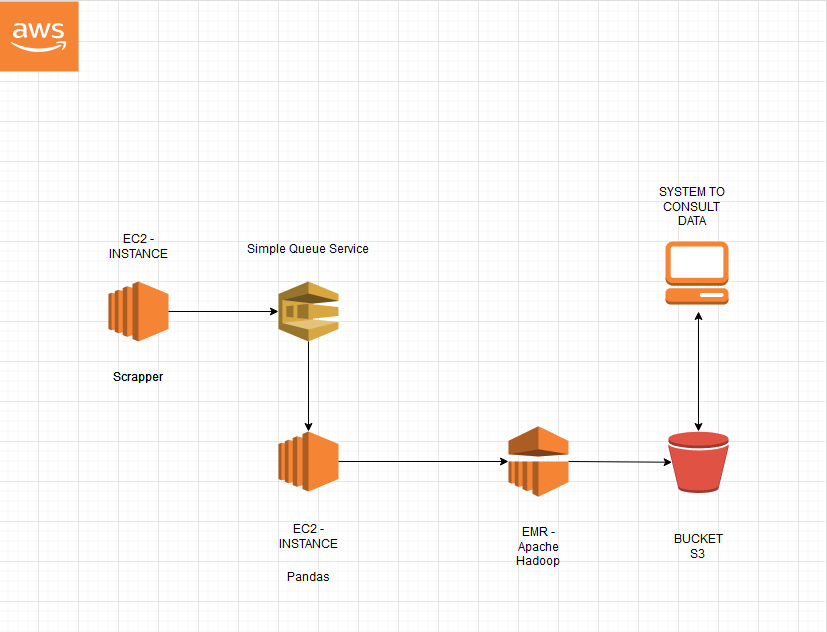

## EP01 - POKEMONS

This project has the function to extract pokemons with Scrapy, filter these pokemons with Pandas and create metrics with MrJob using MapReduce


## Demo
### STEP 1 - EXTRACT POKEMONS 
```cmd
cd scraper

scrapy runspider Scraper.py
```

### STEP 2 - FILTER POKEMONS 
```cmd
cd filter

python Filter.py
```

### STEP 3 - GET METRICS 
```cmd
cd mapper

! GETING AMOUNT OF POKEMONS TYPE
python MapperType.py ..\filter\pokemons.csv > types

! GETING AVERAGE OF POKEMONS DAMAGES
python MapperAverage.py ..\filter\pokemons.csv > average
```


## Architecture




## Infos

 - [Scrapy](https://github.com/scrapy/scrapy)
 - [Pandas](https://pandas.pydata.org/getting_started.html)
 - [MrJob](https://github.com/Yelp/mrjob)


## Authors

- [@Rafael Narbutis](https://github.com/rafaelnarbutis)
- [@Victor Moreno](https://github.com/)


## Badges

[](https://choosealicense.com/licenses/mit/)


## Screenshots


